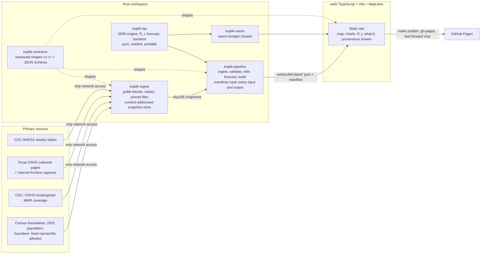

# Koplik

**Measles outbreak intelligence, with a primary source behind every number.**

**Live site: https://jakedevar.github.io/koplik/**

> Demonstration project; not medical or public-health advice; not affiliated with CDC, Texas DSHS,
> the US Census Bureau or WHO.

Koplik spots are the earliest visible sign of measles. Koplik answers, for any US state and for
Texas counties:

| Question | What the site shows | Source |
|---|---|---|
| What is happening? | Weekly cases on a map and charts, always named by case definition: CDC NNDSS "confirmed or unknown-status cases" by state; Texas DSHS "confirmed cases" by county. Definitions are never summed or mixed; missing reports stay missing. | CDC NNDSS, Texas DSHS (live pages and Internet Archive captures) |
| How fast is it spreading? | The effective reproduction number R_t (Cori et al. method) with its credible interval, published only above a minimum case count. | derived, with provenance |
| What if? | An in-browser WebAssembly SEIR simulator for a **hypothetical** introduction of one infectious person into Gaines County, Texas, with its real population and kindergarten MMR coverage. It is not a reconstruction or forecast of the 2025 outbreak. Native and WebAssembly runs are bit-identical for the same seed. | Census 2025 estimates, DSHS coverage, cited parameters |
| Where next? | A 4-8 week renewal-projection forecaster (Nouvellet et al. 2018), tested twice and reported exactly as measured: a real-time-by-vintage backtest on the 2025 West Texas outbreak total (mean CRPS 3.66; 90% intervals contained the truth in 30 of 48 targets), and a **pseudo-real-time** backtest (revised counts truncated at each forecast date) on the CDC state series, where the intervals were far too narrow (pooled 90% coverage 39.0%) and no series beat repeating the latest count. **The site therefore publishes no state forecast**: a series' forecast is shown only where its own measured skill meets a pre-registered rule, and the panel says so and why (#1503). | `crates/koplik-epi`, `data/reports/backtest/` |
| Why trust it? | Every number opens a provenance drawer: source URL, retrieval time, the sha256 of the raw snapshot it came from, the source's terms and attribution. | `SOURCES.md` |

## Architecture



- **Only `koplik-ingest` touches the network.** Tests run offline against committed real-byte
  fixtures in `data/fixtures/`, inside a network namespace (`tools/offline-test.sh`).
- **Determinism.** Every stochastic step takes an explicit seed; native and `wasm32` give identical
  trajectories (`make determinism`); pipeline re-runs are byte-identical.
- **Contracts.** Shared data shapes are versioned in `koplik-contracts`; a released version never
  changes, a new shape is a new version with regenerated JSON Schema and generated web types.
- **Publishing.** `make publish` builds the site from the committed HEAD in a scratch archive, runs
  the offline pipeline there, and fast-forwards `gh-pages` on the repository's origin.

## Build and test

Rust is pinned by `rust-toolchain.toml` (with the `wasm32-unknown-unknown` target); Node and a
Chromium are needed for the web tests.

```bash
make check              # cargo check --workspace --all-targets
make test               # Rust tests, network-isolated
make web-test           # web unit tests, Playwright smoke test, publish test (network-isolated)
make determinism        # native vs wasm32 identical trajectories
make pipeline-fixtures  # build web/public/data from the committed fixtures (offline)
make serve              # serve the site locally
make pipeline           # live: fetch the sources, then build (identifies itself; see SOURCES.md)
```

## Honest limits

- The published data are built from committed source snapshots; each number shows its own
  retrieval time. There is no scheduled live refresh yet.
- Texas DSHS published county tables only for some reports, so most Texas county weeks are shown as
  "No data" rather than estimated (#1439).
- The what-if panel is a hypothetical introduction, not a fit to the 2025 outbreak: the retained
  DSHS reports are too far apart to seed one honestly (see
  `thoughts/shared/notes/gaines-2025-scenario-replay.md`).
- The forecaster's skill was measured on the Texas DSHS outbreak total; series it was not tested on
  say so (#1503).

## How it was built

Koplik is built by an agent team run by the RSI harness manager, using the integrator model RSI
uses to build itself: workers on sandbox branches, one independent reviewer from another model
family for method, contract, provenance and network changes, and landing on `rolling` by
fast-forward only.

| Read | For |
|------|-----|
| [`AGENTS.md`](AGENTS.md) | How work is done here: principles, hard rules, landing |
| [`SOURCES.md`](SOURCES.md) | Every source: URL, terms, attribution, cadence, client identification |
| [`thoughts/shared/project/koplik-spec.md`](thoughts/shared/project/koplik-spec.md) | Product spec: Epics, intent, acceptance criteria |
| [`thoughts/shared/research/backtest-2025-west-texas.md`](thoughts/shared/research/backtest-2025-west-texas.md) | The pre-registered forecast backtest and its measured scores |
| [`thoughts/shared/research/backtest-cdc-states.md`](thoughts/shared/research/backtest-cdc-states.md) | The pre-registered pseudo-real-time backtest on the CDC state series, with its amendments and measured scores |
| [`thoughts/shared/manager/`](thoughts/shared/manager/) | Manager brief, worker contract, handoffs |

Branches: `rolling` is agent intake (fast-forward only). `main` is promoted from a QA-green SHA
(`thoughts/shared/qa/qa-green.sha`). `gh-pages` is the published site.
